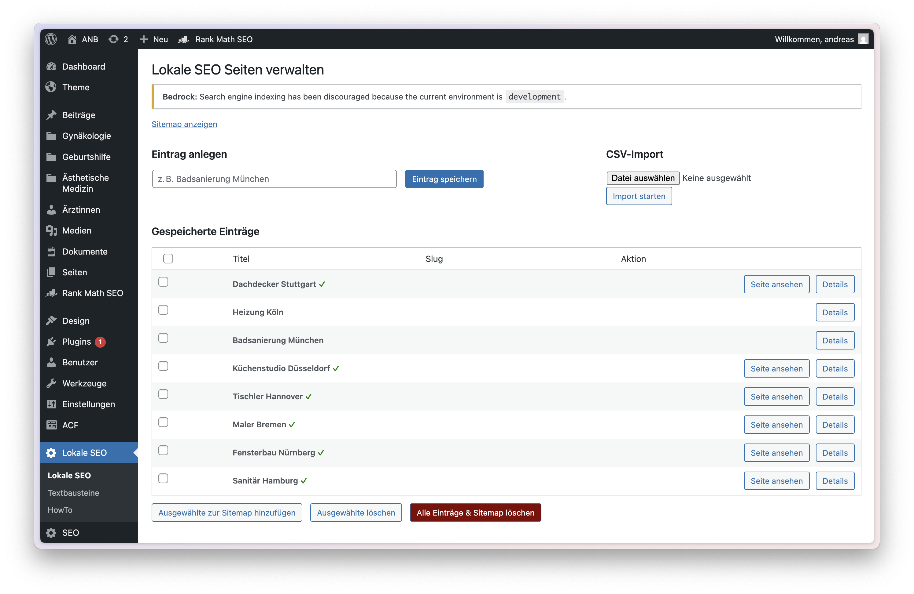
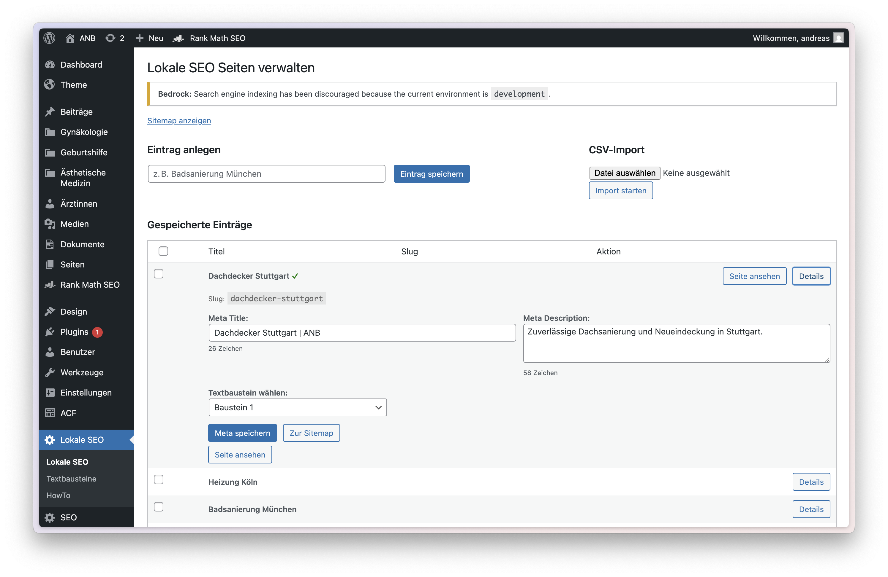
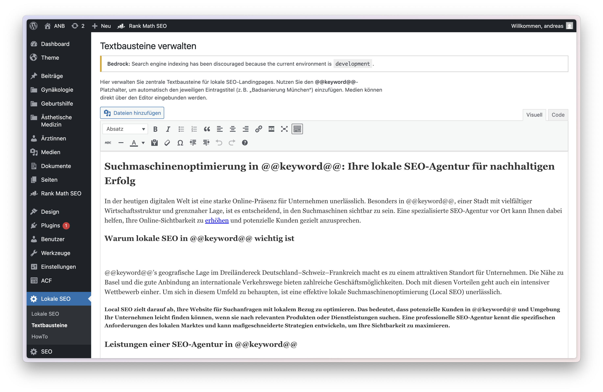

# Local SEO Sitemap Manager – Powerful WordPress SEO Plugin for Local Landing Pages and XML Sitemaps

A powerful WordPress plugin for creating, managing, and optimizing local SEO landing pages – with automated XML sitemap generation, dynamic metadata, and Blade view integration.

Enhance your WordPress site with fully optimized local SEO landing pages. This plugin provides structured metadata management, reusable content blocks, and automatic sitemap support – ideal for businesses targeting regional search traffic.

## Features

- ✅ Add local landing page entries (e.g. *Badsanierung München*)
- ✅ Auto-generate SEO-friendly slugs
- ✅ Edit Meta Title and Meta Description per entry
- ✅ See character counts for meta inputs
- ✅ Assign content snippets using `@@keyword@@` placeholders
- ✅ Render dynamic frontend views using Blade (Sage-compatible)
- ✅ Automatically generate an XML sitemap at `/lokale-sitemap.xml`
- ✅ Import multiple entries via CSV
- ✅ Tag analysis for SEO optimization of snippets (h1, h2, p, a, etc.)
- ✅ Admin interface with detail toggle and sitemap integration
- ✅ Instructions page ("HowTo") built into admin panel

## Requirements

- WordPress (5.9+)
- Sage theme by Roots (Blade support required)
- PHP 8.0+

---

## Installation

1. Download or clone the repository into your plugin directory:
   ```
   wp-content/plugins/local-seo-sitemap/
   ```

2. Activate the plugin via the WordPress admin panel.

3. On activation:
   - A database table (`wp_lokale_seo_pages`) is created.
   - A default Blade view file `resources/views/lokale-seo.blade.php` is generated if missing.

---

## Usage Guide

Below are example screenshots of the plugin in use:





### 1. Add a Local Entry

Navigate to **WP Admin > Lokale SEO**.  
Enter a city + service combination (e.g. `Badsanierung München`) and save.  
→ The plugin will create a slug like `/badsanierung-muenchen`.

### 2. Edit Metadata and Assign Snippet

Click **Details** to expand:
- Set a `Meta Title` and `Meta Description`
- Assign a text snippet
- Character counts will update live
- Save metadata and optionally add entry to the sitemap

### 3. Create Snippets

Go to **Lokale SEO > Textbausteine**:
- Use the WYSIWYG editor with media support
- Insert `@@keyword@@` where the entry title should appear
- Below the editor you’ll see a breakdown of used HTML tags (e.g. `<h1>`, `<a>`, `<blockquote>`)

### 4. CSV Import

On the main plugin page:
- Use the **CSV Import** form to upload entries in bulk
- Required format:
```csv
title,meta_title,meta_description
Badsanierung München,Badsanierung München | ANB,Badsanierung München: Professional bathroom renovation.
Fliesenleger Berlin,Fliesenleger Berlin | ANB,Expert tile laying service in Berlin.
```

Only new entries will be imported (duplicates are ignored).

### 5. Generate Sitemap

Click **Zur Sitemap** to include an entry.  
The sitemap is generated at:

```
https://yourdomain.test/lokale-sitemap.xml
```

Entries not added to the sitemap remain unpublished.

### 6. View Live Page

Each entry added to the sitemap is rendered dynamically using Blade at:

```
https://yourdomain.test/<slug>
```

The plugin injects all metadata and uses the selected snippet as HTML body.

---

## Developer Notes

- Blade template rendering (`lokale-seo.blade.php`) is handled within plugin logic
- View is automatically created on activation if not present
- Snippets are stored in a separate table (`wp_lokale_seo_snippets`)
- Structured Data (JSON-LD) for `LocalBusiness` is included
- Meta tags: title, description, Open Graph, Twitter, robots, etc.
- XML sitemap updates immediately after changes
- Content preview available in admin

---

## License

MIT License © 2024–2025 Andreas Burget